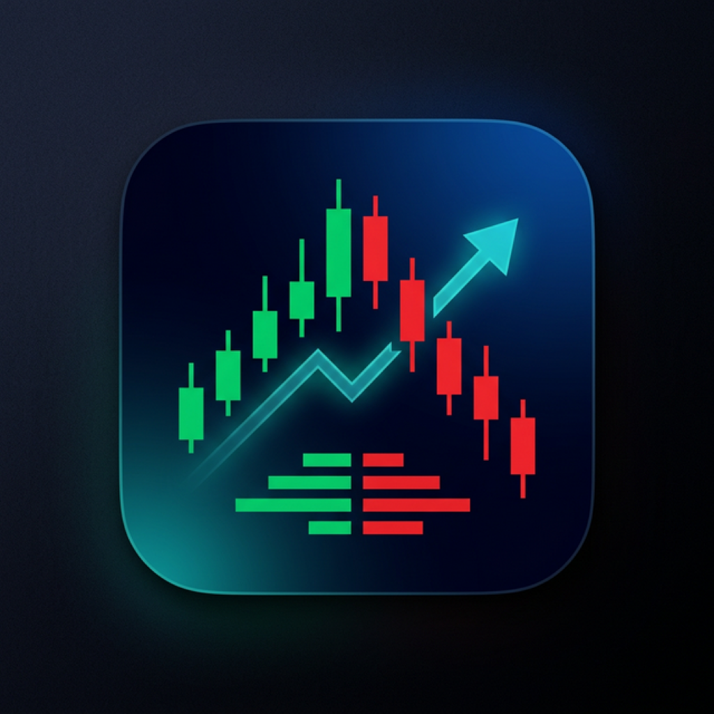

<p align="center">
  
</p>

<h1 align="center">FullStack Trade</h1>

<p align="center">
  A native iOS orderbook widget built with SwiftUI that displays real-time Level 2 order book data from Hyperliquid's WebSocket API.
</p>

<p align="center">
  
  
  
  
</p>

---

## Features

- 📊 **Live Orderbook** — Real-time bids and asks with animated depth visualization bars
- 🪙 **Multi-Symbol Support** — Switch between BTC and ETH trading pairs instantly
- 🎯 **Adjustable Precision** — Configure significant figures (2, 3, 4, or 5 sig figs)
- ⚡ **Price Flash Animations** — Visual highlights on new price levels as they appear
- 📈 **Mid-Price Direction** — Arrow indicator showing price movement direction (up/down)
- 📉 **Spread Display** — Live spread calculation with percentage and absolute values
- 🔄 **Auto-Reconnect** — Resilient WebSocket connection with exponential backoff (up to 10 retries)
- 📳 **Haptic Feedback** — Tactile feedback on coin/precision switches and connection events
- 🌙 **Dark Mode** — Professional trading-app aesthetic with custom color theme

## Tech Stack

| Layer | Technology |
|---|---|
| **UI Framework** | SwiftUI with `@Observable` macro |
| **Architecture** | MVVM (Model-View-ViewModel) |
| **Reactive Layer** | Combine (`PassthroughSubject`, `CurrentValueSubject`, `AnyPublisher`) |
| **Networking** | Native `URLSessionWebSocketTask` — zero third-party dependencies |
| **Data Source** | [Hyperliquid WebSocket API](https://hyperliquid.gitbook.io/hyperliquid-docs/) (`wss://api.hyperliquid.xyz/ws`) |
| **Animations** | SwiftUI `withAnimation`, `.contentTransition(.numericText())` |
| **Haptics** | `UISelectionFeedbackGenerator`, `UIImpactFeedbackGenerator`, `UINotificationFeedbackGenerator` |
| **Build System** | XcodeGen (`project.yml`) + Xcode 15 |
| **Min Deployment** | iOS 17.0 |
| **Language** | Swift 5.9 |

## Architecture

```
FullStackTrade/
├── App/
│   └── FullStackTradeApp.swift          # @main entry point
├── Models/
│   ├── OrderBookModels.swift            # TradingCoin, PriceLevel, ConnectionState
│   └── WebSocketModels.swift            # WebSocket message types (subscribe/response)
├── Services/
│   └── HyperliquidWebSocketService.swift # WebSocket connection, reconnect, ping/pong
├── ViewModels/
│   └── OrderBookViewModel.swift         # Data processing, cumulative totals, flash detection
├── Views/
│   ├── OrderBookView.swift              # Main screen: coin/precision selectors, order book
│   └── PriceLevelRow.swift              # Individual price level row with depth bar
└── Theme/
    └── Colors.swift                     # Custom color palette (backgrounds, text, trading colors)
```

## Testing

The project has a comprehensive test suite across three categories:

| Test Suite | Tests | Description |
|---|---|---|
| **Unit Tests** (`OrderBookViewModelTests`) | 11 | ViewModel logic: data processing, sorting, cumulative totals, mid-price direction |
| **Model Tests** (`ModelTests`) | — | Data model validation and formatting |
| **Integration Tests** (`IntegrationTests`) | 11 | End-to-end flows using mock WebSocket service |
| **Performance Tests** (`PerformanceTests`) | 9 | Benchmarks for formatting, data processing, flash detection |
| **UI Tests** (`OrderBookUITests`) | 13 | XCUITest: launch, coin/precision switching, rapid interaction stability |

All tests run offline using `MockWebSocketService` — no network dependency, completes in seconds.

```
FullStackTradeTests/
├── OrderBookViewModelTests.swift    # ViewModel unit tests
├── ModelTests.swift                 # Model unit tests
├── IntegrationTests.swift           # Mock-based integration tests
├── PerformanceTests.swift           # Performance benchmarks
└── MockWebSocketService.swift       # Shared test mock

FullStackTradeUITests/
└── OrderBookUITests.swift           # UI automation tests
```

## Getting Started

1. Clone this repository
2. Open `FullStackTrade.xcodeproj` in Xcode
3. Build and run on a simulator or device (**⌘R**)
4. Run all tests with **⌘U**

> **Note**: The project uses [XcodeGen](https://github.com/yonaskolb/XcodeGen) — if you modify `project.yml`, regenerate the project with `xcodegen generate`.

## API

This app connects to the **Hyperliquid WebSocket API**:

| | |
|---|---|
| **Endpoint** | `wss://api.hyperliquid.xyz/ws` |
| **Channel** | `l2Book` |
| **Subscription** | L2 Book data with configurable `nSigFigs` precision |
| **Ping Interval** | 15 seconds |
| **Reconnect** | Exponential backoff, max 10 attempts (capped at 30s) |

## License

Private — All rights reserved.
